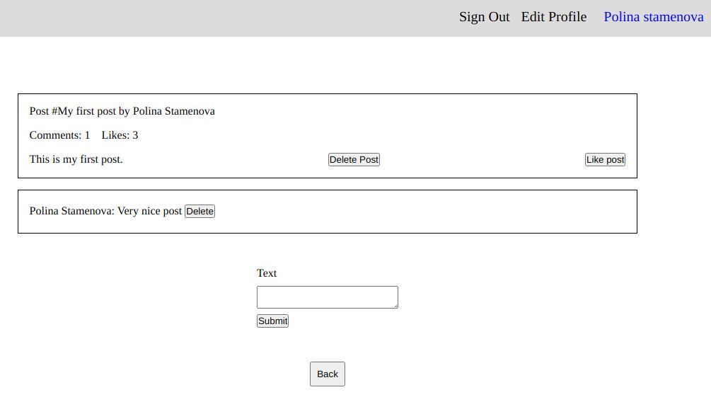

# Blog:

Classic blog website



## Description:

Blog website that shows a list of posts and empower readers to interact with them by adding comments and liking posts.

## Built With

- Ruby on Rails
- PostgreSQL

[Heroku](https://pure-retreat-86553.herokuapp.com/users/sign_in)

## Getting Started

To get a local copy up and running follow these simple example steps.

## Instructions

```
$ cd <folder>
```

```
$ git clone git@github.com:PolinaStamenova/my-blog.git
```

```
$ cd school-library
```

## Install

```
$ bundle install
```

## Run

```
$ rails db:migrate
```

```
$ rails db:seed
```

```
$ rails s
```

## Test

```
  rspec spec
```

## Authors

👤 **Polina Stamenova**

- GitHub: [@githubhandle](https://github.com/PolinaStamenova)
- LinkedIn: [LinkedIn](https://www.linkedin.com/in/polina-stamenova-a60766112/)

## 🤝 Contributing

Contributions, issues, and feature requests are welcome!

Feel free to check the [issues page](https://github.com/PolinaStamenova/my-blog/issues).

## Show your support

Give a ⭐️ if you like this project!

## Acknowledgments

- Microverse
